# current_based_anomaly_detection_with_GAN_and_AE

# 1. Requirements
   - pytorch
   - numpy
   - pandas
   - sklearn
   - optuna

# 2. Overview
   - Description: This project is about error detection of linear feed axis and CNC machining center based on motor current data.
   - Flowchart:
   
   - Procedure:

1. Linear feed axis data pre-training autoencoder
2. Data Augmentation via W-DCGAN
3. Classification of CNC signals via transfer learning

# 3. data collection and preprocessing
## linear feed axis data
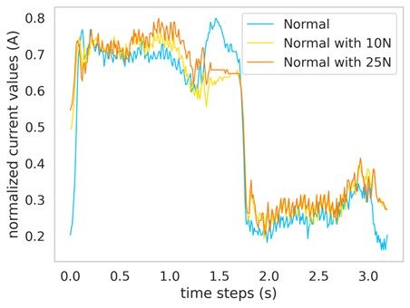
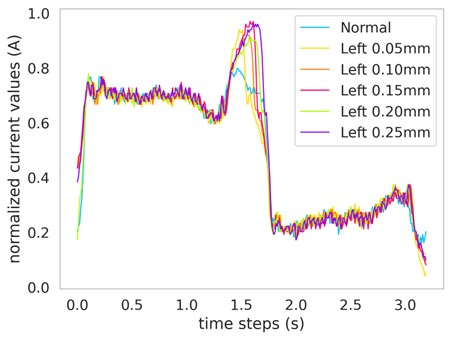
## CNC data
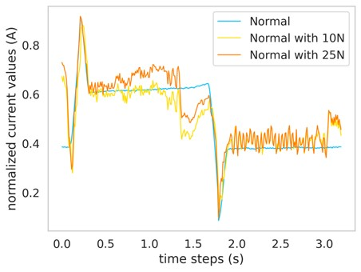
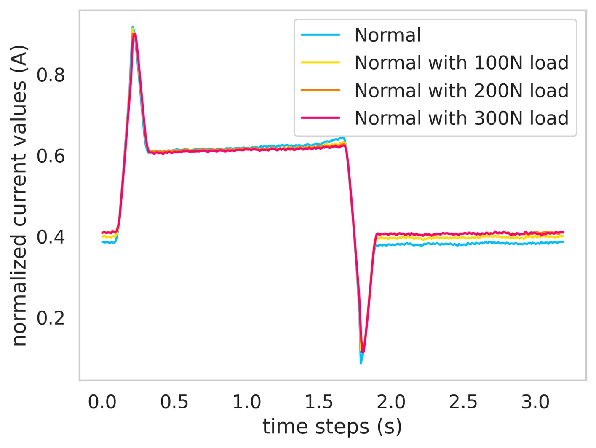
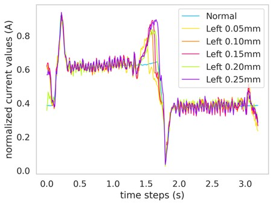

# 4. data generation using W-DCGAN

## linear feed axis data
linear feed axis movie.gif

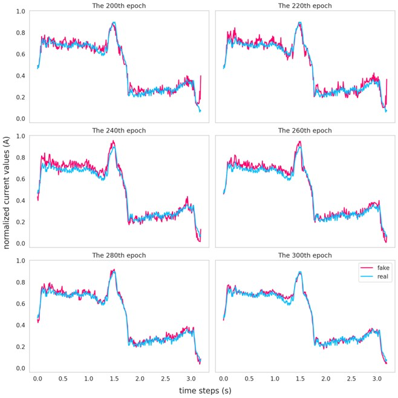
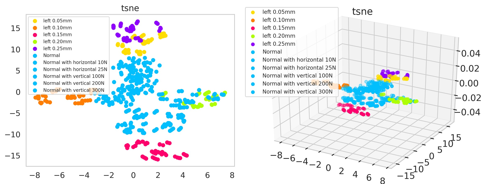
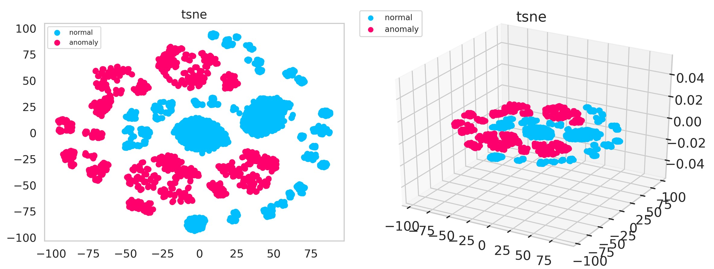

## CNC data
cnc movie.gif

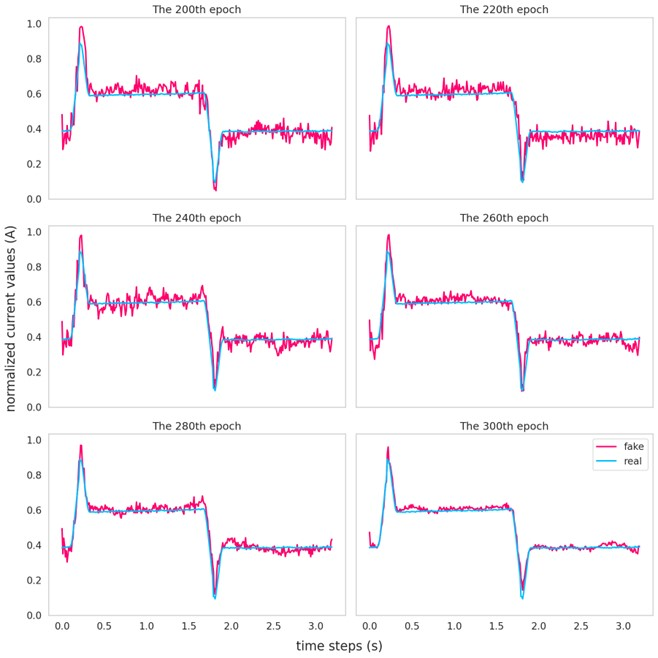
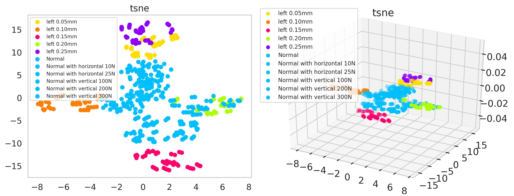
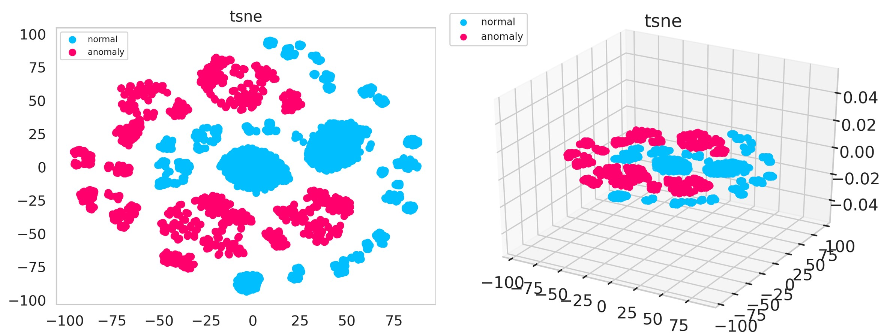

# 5. Fault detection using various autoencoders
## CNN-AE

## TCN-AE

## LSTM-AE

## CNN-LSTM-AE

**Result:**
train on linear feed axis data:
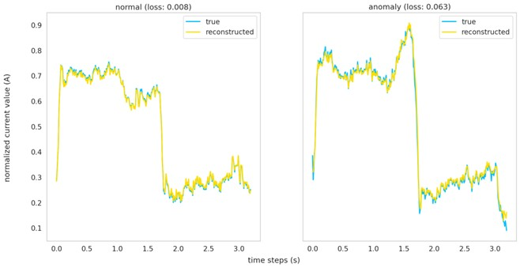
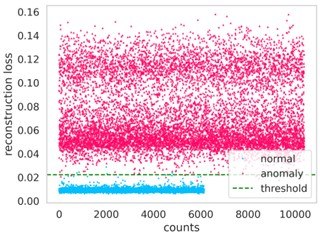
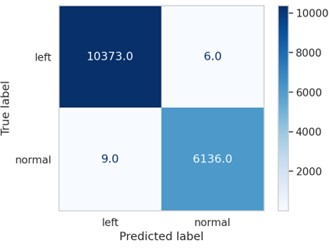
transfer to CNC data
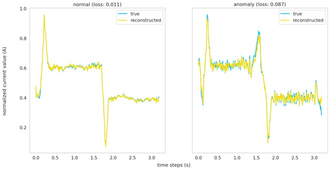

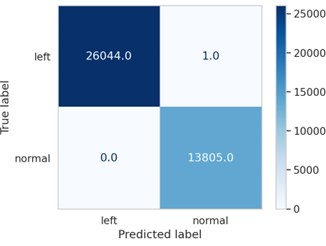
